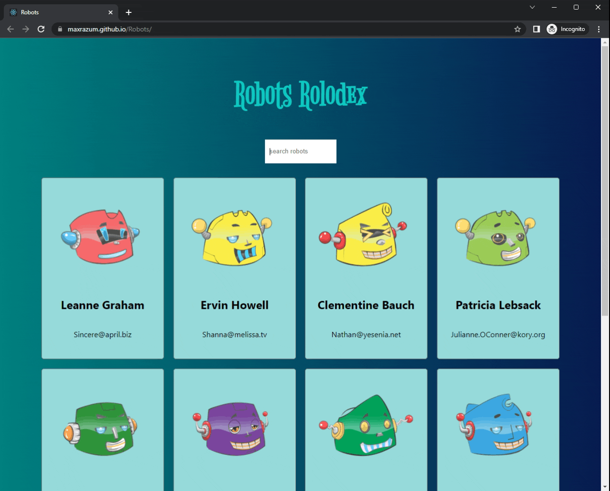

# Robots Rolodex

* Robots Rolodex web app created using create react-app, react-class-components.

## Find robots from
[ROBOHASH](https://robohash.org/)

### LANGUAGES

    - Javascript
    - HTML
    - CSS

### Built with

- [React.js](https://reactjs.org/) - React is a free and open-source front-end JavaScript library for building user interfaces based on UI components.

## Preview

## Instructions

* `git clone https://github.com/maxrazum/Robots.git`
* `cd robots-rolodex`
* `npm start`

Runs the app in the development mode. 
Open [http://localhost:3000](http://localhost:3000) to view it in the browser.
